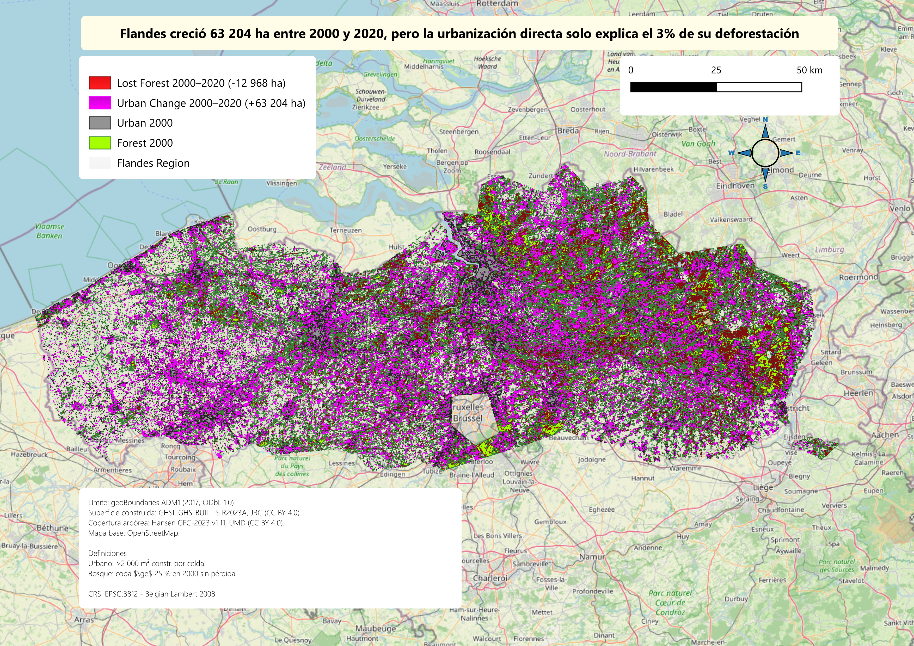

# Urban Dynamics and Forest Loss in Flanders, Belgium (2000–2020)

**Project Question:** How much and where did Flanders expand, and what happened to its forested areas?

**Main Finding:** Between 2000 and 2020, the urban footprint of Flanders grew by **63,204 ha (42.4%)**, while the region lost **12,968 ha of forest**. Through spatial analysis, it was identified that **3.0%** of this total deforestation (390.5 ha) directly coincided with areas of new urbanization, indicating that city growth was not the primary driver of forest loss.

## Final Figures

| | 2000 | 2020 | \(\Delta\) ha | \(\Delta\) % |
| :--- | :--- | :--- | :--- | :--- |
| **Urban (ha)** | 149,046 | 212,250 | +63,204 | +42.4% |
| **Urban (% of area)** | 10.9% | 15.5% | +4.6 pp | |
| **Forest (ha)** | 258,605 | 245,637 | -12,968 | -5.0% |
| **Forest (% of area)** | 18.9% | 18.0% | -0.9 pp | |

*Percentage denominator: 1,366,084 ha (ADM1 analysis area, excluding the Brussels-Capital Region).*

## Operational Definitions

*   **Urban cover:** GHSL cell (100x100 m) with more than 2,000 m² of built-up surface.
*   **Forest cover:** Hansen cell (30x30 m) with at least 25% tree canopy density in 2000, with no recorded loss until 2020.
*   **Coordinate Reference System (CRS):** EPSG:3812 - Belgian Lambert 2008.

## Repository Structure

*   `pf-qgis-2026-flanders-belgium.gpkg`: Kart working copy containing the versioned vector layers of the results.
*   `Final_Report.pdf`: Comprehensive methodological report detailing technical decisions, spatial limitations (such as the geometric exclusion of Brussels and the Voeren enclave), and conclusions.
*   `final_map.png` / `final_map.pdf`: Final cartographic layout exported at 300 dpi.
*   `inputs/`: 
    *   `geoBoundaries-MYS-ADM1.geojson`: Original source vector file.
    *   `ghsl/` and `hansen/`: Folders intended for raw global rasters (excluded from versioning).
    *   `clipped/`: Clipped and reprojected rasters, alongside binary masks.
    *   `reports/`: Unique values reports in HTML format and GeoPackage tables.

## Data Sources

| Layer | Source | Details | License |
| :--- | :--- | :--- | :--- |
| **Administrative boundary** | geoBoundaries | ADM1 (2017) | ODbL 1.0 |
| **Built-up surface** | GHSL | GHS-BUILT-S R2023A (JRC) · 100 m · Tiles R4_C19, R3_C19 | CC BY 4.0 |
| **Tree canopy 2000** | Hansen | GFC-2023 v1.11 (UMD) · 30 m · Granule 60N_000E | CC BY 4.0 |
| **Year of loss** | Hansen | GFC-2023 v1.11 (UMD) · 30 m · Granule 60N_000E · Period 2000–2020 | CC BY 4.0 |
